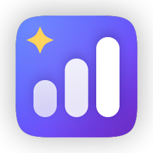
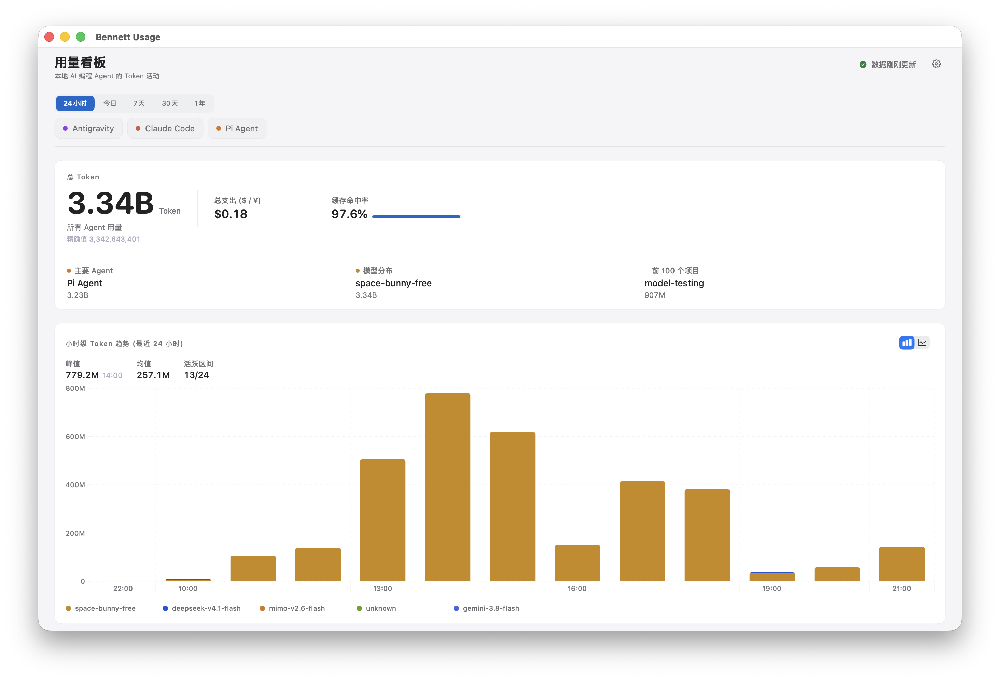
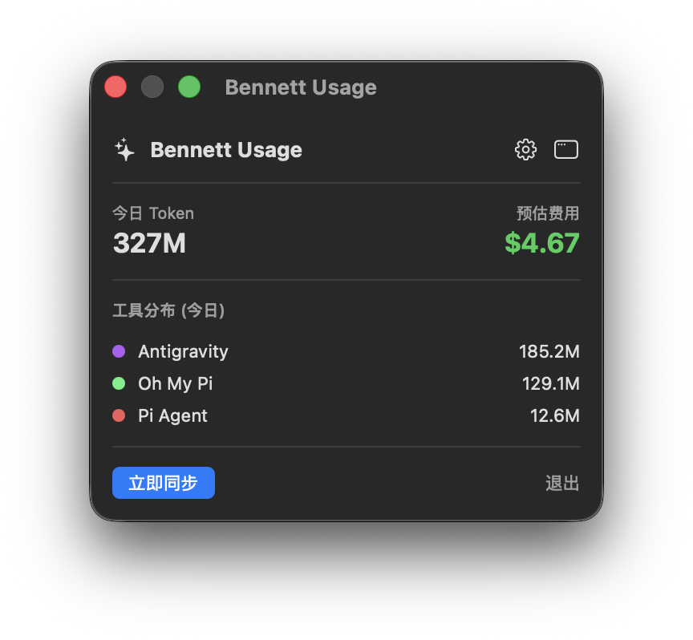
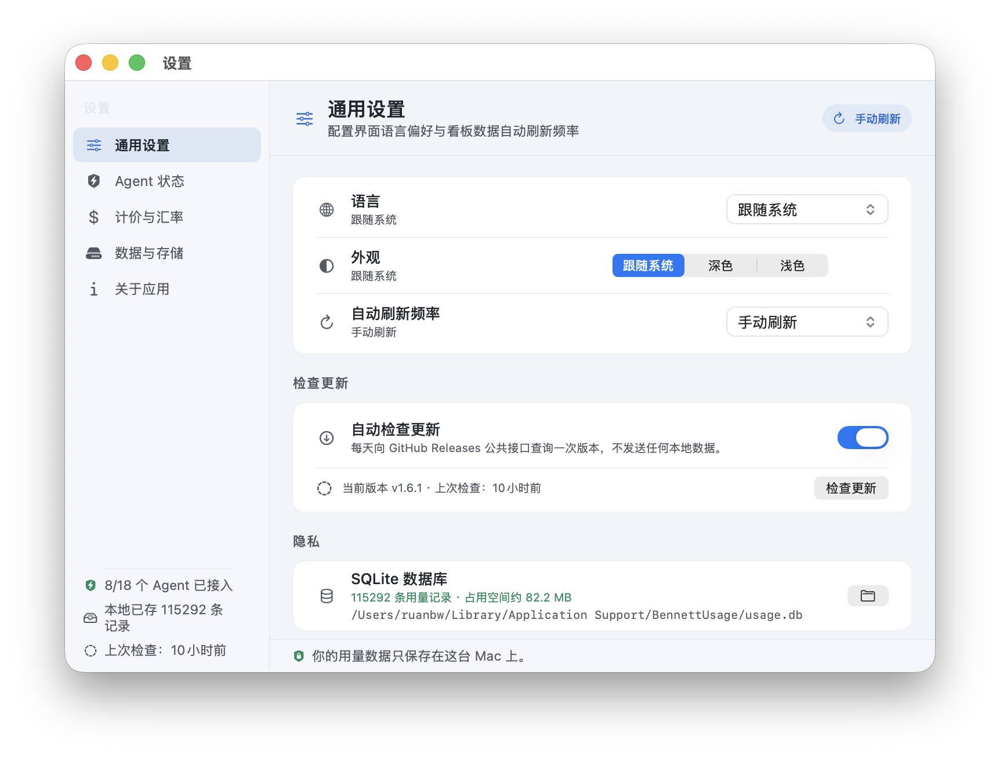

<h1 align="center">
  <br>
  Bennett Usage
</h1>

<p align="center">
  <strong>你用的每个 AI coding 助手，Token 用量尽在掌握 —— 一个菜单栏图标，一个 Dashboard。</strong>
</p>

<p align="center">
  <a href="https://github.com/ruanbw/bennett-usage/releases/latest"></a>
  
  
  
  <a href="LICENSE"></a>
</p>

<p align="center">
  <strong>简体中文</strong> · <a href="README.md">English</a>
</p>

---

macOS 菜单栏常驻的 AI coding 助手 Token 用量统计，聚合 **18 个工具**：Claude Code、OpenAI Codex、Continue CLI、Gemini CLI、Goose、Crush、Kimi Code、Qwen Code、OpenCode、Roo Code / Cline / Kilo（VS Code 扩展）、Cline（桌面版 / CLI）、DSH Harness、Oh My Pi、Pi Agent、Antigravity。Cursor、GitHub Copilot、Trae 显示安装状态（云端计费，取数需 API）。

全部从本机会话存储解析，无需 API Key、无需账号，数据不出本机。



## 功能

- **菜单栏速览**：常驻显示今日 Token，点击弹出今日用量、预估费用、各工具分布，一键立即同步。
- **Dashboard**：24 小时 / 今日 / 7 天 / 30 天 / 过去一年 / 按年查看；小时级 Token 趋势（按模型堆叠，柱状 / 折线可切）；工具消耗占比、模型消耗占比；年度热力图（日历 / 月趋势可切）；项目排行；缓存命中统计。
- **设置**：通用（语言、自动刷新频率、自动检查更新）、Agent 状态（是否已安装、立即重扫）、计价与汇率（USD / CNY、自定义汇率）、数据与存储（数据库位置、一键清空）、关于（检查更新）。
- **检查更新**：读取 GitHub Releases 判断是否有新版本，自动检查（每天一次，可关闭）+ 手动检查；发现新版本时菜单栏图标与弹窗提示，并按本机架构给出对应 DMG 下载，可跳过某个版本。
- **18 个数据源**：本地解析各工具会话记录，无需 API Key，纯本地 SQLite 存储，FSEvents 文件监听自动同步（Cursor / Copilot / Trae 为云端计费，仅检测安装状态）。
- **中英双语**：简体中文 / English / 跟随系统。





## 安装

1. 从 [Releases](../../releases) 下载对应架构的 DMG：
   - Apple Silicon（M 系列）：`BennettUsage-<版本>-arm64.dmg`
   - Intel：`BennettUsage-<版本>-x86_64.dmg`
   - 不确定 / 想一个包通用：`BennettUsage-<版本>-universal.dmg`
2. 打开 DMG，把 `Bennett Usage` 拖进 Applications。
3. 首次启动用右键 → 打开（未经过 Apple 公证，右键打开一次即可，以后正常双击）。

要求 macOS 14+，Apple Silicon / Intel 均可。

## 从源码构建

```sh
swift build -c release
swift test                          # 跑测试
./scripts/package-dmg.sh            # 默认出 arm64 / x86_64 / universal 三个包
./scripts/package-dmg.sh 1.4.1      # 指定版本号
./scripts/package-dmg.sh 1.3.0 --only universal   # 只出其中一个
# 输出 dist/BennettUsage-<版本>-<架构>.dmg 与 dist/SHA256SUMS.txt
```

脚本在任意一台 Mac 上交叉编译两种架构（Intel 机器也能打出 arm64 / universal 包）。

## 数据来源

| 工具 | 默认路径 | 说明 |
| --- | --- | --- |
| Claude Code | `~/.claude/projects` | JSONL transcript，按 `message.id` 去重 |
| OpenAI Codex | `~/.codex/sessions` | rollout JSONL 的 `token_count` 事件 |
| Continue CLI | `~/.continue/sessions` | session JSON 中逐条 assistant usage；可用绝对路径 `CONTINUE_GLOBAL_DIR` 改目录 |
| Gemini CLI | `~/.gemini/tmp` | session JSONL |
| Qwen Code | `~/.qwen/tmp`（`QWEN_HOME` 可改） | Gemini 分叉，同格式 |
| Kimi Code | `~/.kimi-code/sessions`（`KIMI_CODE_HOME` 可改） | 只读当前格式 `sessions/**/agents/**/wire.jsonl`；不读旧版 `~/.kimi/context.jsonl` |
| OpenCode | `~/.local/share/opencode` | `opencode.db`，老版本走 `storage/message` |
| Roo Code·Cline·Kilo（VSCode 扩展） | VSCode `globalStorage/*/tasks` | `api_conversation_history.json` |
| Cline（桌面版 / CLI） | `~/.cline/data/sessions` | `messages.json` 逐条 assistant `metrics`；`CLINE_DIR` / `CLINE_DATA_DIR` / `CLINE_SESSION_DATA_DIR` 可改 |
| DSH Harness | `~/.dsh/sessions`（`DSH_HOME` 可改） | `session.v3.jsonl.zstd`，无 zstd 时回退 projcache |
| Crush | `~/Library/Application Support/crush`（`CRUSH_GLOBAL_DATA` 可改，也支持 XDG 回退） | 只读 `projects.json` 注册的 `data_dir/crush.db`，按顶层 session 累计值计算增量 |
| Oh My Pi | `~/.omp/agent/sessions` | 另支持 `~/.omp/stats.db` |
| Pi Agent | `~/.pi/agent/sessions` | |
| Antigravity | `~/.gemini/antigravity/conversations` | |
| Goose | `~/Library/Application Support/Block/goose/sessions/sessions.db` | 只读 SQLite `usage_ledger`；绝对 `GOOSE_PATH_ROOT` 使用 `$GOOSE_PATH_ROOT/data/sessions/sessions.db` |
| GitHub Copilot | `~/.copilot` | 仅检测安装，token 需 GitHub API |
| Cursor | `~/Library/Application Support/Cursor` | 仅检测安装，token 需 Dashboard API |
| Trae | `~/.trae` | 仅检测安装，云端计费 |

数据库在 `~/Library/Application Support/BennettUsage/usage.db`，删掉即清零重算。

常用启动参数：`BennettUsage.app/Contents/MacOS/BennettUsageApp --dashboard`（直接打开 Dashboard）。

## 计价

内置各模型单价，按输入 / 输出 / 缓存读 / 缓存写分别计价，汇总为 USD，可一键切换 CNY（汇率自定义）。价格表随模型变化会有滞后，费用为估算值。Kimi Code 的 wire 记录不包含权威的 provider 或费用字段，因此其费用只来自本地价格表，是估算值，不代表实际账单。

## 隐私

所有解析和存储都在本机完成，不上传任何数据。

唯一的对外请求是「检查更新」：向 GitHub Releases 公共接口发起一次匿名 `GET`（无 Token、无账号、请求中不含任何用量、项目或机器信息），每天最多一次，可在 设置 → 通用 → 自动检查更新 中关闭；关闭后应用完全不联网。

## 版本日志

见 [CHANGELOG.md](CHANGELOG.md)。

## License

MIT，见 [LICENSE](LICENSE)。
